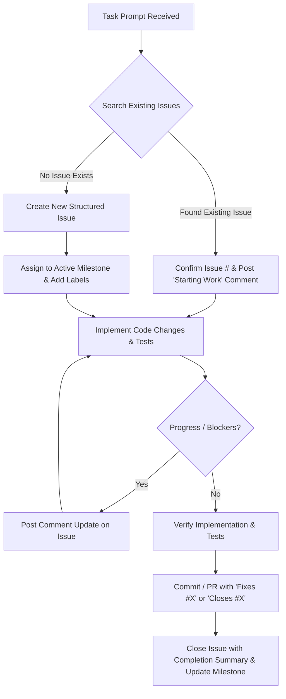

# GitHub Issues & Milestones Protocol for AI Dev Agents

> **Role & Purpose**: This guide is a mandatory operational protocol for any AI dev agent working on this repository (`kulokaitei/landingpagereal`). Every code task, feature, fix, or refactor must be tracked cleanly on GitHub Issues and aligned with project Milestones.

---

## 🎯 Core Principles

1. **No Untracked Work**: Never write code or implement changes without an active GitHub Issue associated with the task.
2. **Check Before Creating**: Always search existing issues first to avoid duplicates.
3. **Keep Real-Time State**: Post comments when starting work, hitting blockers, or completing milestones.
4. **Structured & Objective**: Follow standard issue templates and link commits/PRs cleanly (e.g., `Closes #12`, `Fixes #34`).

---

## 🔄 Lifecycle Workflow for AI Agents



---

## 📋 Step-by-Step AI Agent Instructions

### Step 1: Task Intake & Search
Before modifying code:
1. **Find Open Issues**:
   - Using GitHub MCP: `search_issues` or `list_issues` for `owner: "kulokaitei"`, `repo: "landingpagereal"`, `state: "open"`.
   - Using GitHub CLI (if MCP unavailable): `gh issue list --state open`
2. **If Found**: Note the Issue number (e.g., `#15`). Post a short comment stating work is beginning.
3. **If Not Found**: Create a new issue using the templates below.

---

### Step 2: Creating a New Issue
When creating an issue, assign:
- **Repository**: `kulokaitei/landingpagereal`
- **Labels**: `enhancement`, `bug`, `refactor`, `documentation`, or `ui/ux`
- **Milestone**: Assign to the active milestone if one exists.

#### Issue Template Structure:
```markdown
## 🎯 Objective
[1-2 clear sentences explaining the goal]

## 🛠️ Scope of Changes
- [ ] [Task / Component 1]
- [ ] [Task / Component 2]
- [ ] [Task / Component 3]

## ✅ Acceptance Criteria
- [ ] Criterion 1 (e.g., Component renders smoothly on desktop and mobile)
- [ ] Criterion 2 (e.g., All automated tests pass / No console errors)

## 📌 Context & References
- Related issues / PRs: (e.g., Refs #10)
- Relevant files: `src/components/Example.tsx`, `index.html`
```

---

### Step 3: During Implementation
- Check off checklist items as they are completed.
- If a technical blocker, scope change, or design divergence arises, add an issue comment immediately explaining the pivot.

---

### Step 4: Completion & Closing
When the task is completed and verified:
1. **Commit Message Format**:
   ```
   feat(hero): implement glassmorphism navigation bar (Closes #15)
   ```
   *or for bugfixes:*
   ```
   fix(auth): correct token refresh race condition (Fixes #22)
   ```
2. **Add Closing Summary Comment** on the issue:
   ```markdown
   ### 🏁 Resolution Summary
   - Implemented: [Brief list of changes]
   - Files Modified: `[file path 1]`, `[file path 2]`
   - Verification: [Build check / browser verification completed]
   ```
3. **Close the Issue** with state `"closed"` (or ensure it automatically closes via linked PR/commit).
4. **Milestone Check**: Check if all issues in the active milestone are completed. If so, report milestone completion in chat.

---

## 🧰 Tool Reference for Agents

### 1. GitHub MCP Tools (Preferred)
| Tool | Action | Parameters |
| :--- | :--- | :--- |
| `search_issues` | Search open issues | `query: "repo:kulokaitei/landingpagereal is:open <keywords>"` |
| `list_issues` | List repository issues | `owner: "kulokaitei"`, `repo: "landingpagereal"`, `state: "open"` |
| `issue_read` | Read specific issue details | `owner: "kulokaitei"`, `repo: "landingpagereal"`, `issue_number: <num>` |
| `issue_write` | Create or update an issue | `owner: "kulokaitei"`, `repo: "landingpagereal"`, `title: "..."`, `body: "..."` |
| `add_issue_comment` | Post progress / summary comment | `owner: "kulokaitei"`, `repo: "landingpagereal"`, `issue_number: <num>`, `body: "..."` |

### 2. GitHub CLI Fallback (`gh` command)
```bash
# List open issues
gh issue list --repo kulokaitei/landingpagereal

# Create new issue
gh issue create --repo kulokaitei/landingpagereal --title "feat: descriptive title" --body "..." --label "enhancement"

# Comment on an issue
gh issue comment <num> --repo kulokaitei/landingpagereal --body "Starting work on this task."

# Close an issue
gh issue close <num> --repo kulokaitei/landingpagereal --comment "Completed in commit/PR."

# Check milestones
gh api repos/kulokaitei/landingpagereal/milestones
```

---

## 🏷️ Standard Labels

| Label | Description |
| :--- | :--- |
| `feat` / `enhancement` | New features or visual additions |
| `bug` | Unexpected behavior, broken layouts, or runtime errors |
| `refactor` | Code restructuring without feature change |
| `performance` | Speed, bundle size, or rendering optimization |
| `docs` | Documentation, guides, or README updates |
| `ui/ux` | Design, animations, responsiveness, and aesthetic polish |

---

## ⚡ Agent Quick Checklist (Run on every session)

- [ ] Looked up existing open issues before writing code.
- [ ] Created or identified target Issue Number (`#X`).
- [ ] Associated with active milestone if applicable.
- [ ] Maintained clear commit messages referencing `#X`.
- [ ] Added resolution summary comment before closing `#X`.
